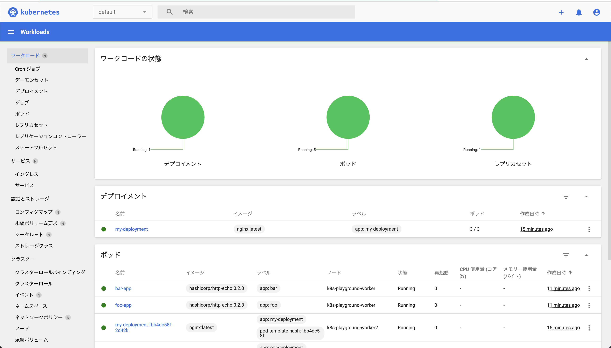

## commands

```sh
# cluster作成
kind create cluster --name k8s-playground --config kind-config.yaml

# cluster削除
kind delete cluster --name k8s-playground
```

### 動作確認


```sh
# ingress
kubectl apply -f https://raw.githubusercontent.com/kubernetes/ingress-nginx/main/deploy/static/provider/kind/deploy.yaml

# Podやらなんやらをつくる
kubectl apply -f target.yaml
```

```sh
COPY
# should output "foo"
curl localhost/foo
# should output "bar"
curl localhost/bar
```

### dashboardを開く

```sh
# SAとClusterRoleBindingを作成
kubectl apply -f dashboard/

# tokenを取得
kubectl -n kubernetes-dashboard get secret $(kubectl -n kubernetes-dashboard get sa/admin-user -o jsonpath="{.secrets[0].name}") -o go-template="{{.data.token | base64decode}}"
```

```sh
# SAとClusterRoleBindingを削除
kubectl delete -f dashboard/
```

[このリンク](http://localhost:8001/api/v1/namespaces/kubernetes-dashboard/services/https:kubernetes-dashboard:/proxy/#/workloads?namespace=default)にアクセスしてtokenを入力するとログインできる




## links
- multi node cluster
  - https://mcvidanagama.medium.com/set-up-a-multi-node-kubernetes-cluster-locally-using-kind-eafd46dd63e5
- ingress
  - https://kind.sigs.k8s.io/docs/user/ingress/
- dashboard
  - https://kubernetes.io/docs/tasks/access-application-cluster/web-ui-dashboard/
